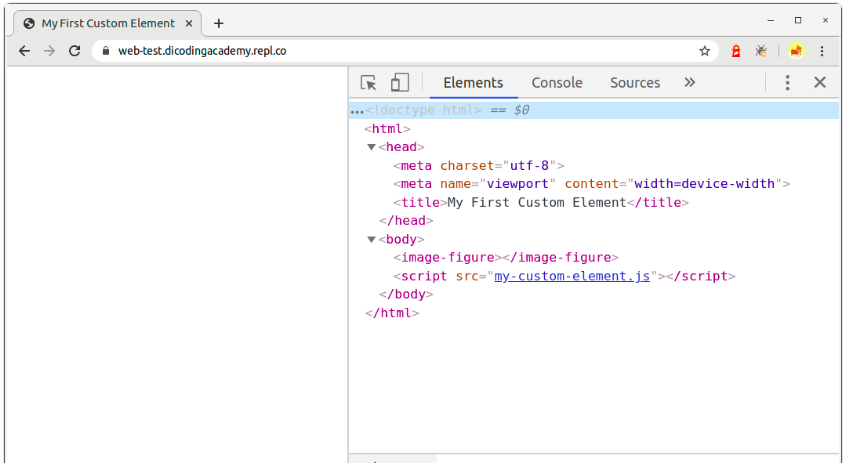

# Menulis Custom Element Pertama
Dalam membuat custom element, kita menuliskannya dengan menggunakan JavaScript class. Class tersebut mewarisi sifat dari HTMLElement. HTMLElement merupakan interface yang merepresentasikan element HTML. Interface ini biasanya diterapkan pada class JavaScript sehingga terbentuklah element HTML baru melalui class tersebut (custom element).

Berikut contoh penulisan dalam membuat custom element:

```
class ImageFigure extends HTMLElement {}
```

Yeay! ImageFigure sekarang merupakan sebuah HTML element baru. Namun tunggu dulu. Untuk menggunakannya pada berkas HTML, kita perlu menetapkan nama tag yang nantinya digunakan pada HTML. Caranya dengan memanggil function define() dari global object customElements seperti ini.

```
customElements.define('image-figure', ImageFigure);
```

customElements merupakan global variable (object) yang digunakan untuk mendefinisikan custom element dan memberitahu bahwa terdapat HTML tag baru. Di dalam customElements terdapat method yang bernama define(). Di sinilah kita meletakkan tag name baru kemudian diikuti dengan JavaScript class yang menerapkan sifat HTMLElement.

***Catatan: Dalam penamaan tag untuk custom element, nama tag harus terdiri dari dua kata yang dipisahkan oleh dash (-). Jika tidak, pembuatan custom element tidak akan berhasil. Hal Ini diperlukan untuk memberi tahu browser perbedaan antara elemen asli HTML dan custom element.***

Setelah mendefinisikan custom element, barulah ia siap digunakan pada berkas HTML. Kita cukup menuliskan tag-nya layaknya elemen HTML biasa.

```
<image-figure></image-figure>
```

```
Jangan lupa lampirkan tag <script> pada berkas yang digunakan untuk menuliskan class ImageFigure.
```

```
<script src="image-figure.js"></script>
```

code lengkapnya:

file html
```
<!DOCTYPE html>
<html>
<head>
  <meta charset="utf-8">
  <meta name="viewport" content="width=device-width">
  <title>My First Custom Element</title>
</head>
<body>
  <image-figure></image-figure>
  <script src="image-figure.js"></script>
</body>
</html>
```
file js.

```
class ImageFigure extends HTMLElement {}
 
customElements.define('image-figure', ImageFigure);
```

Coba jalankan kode di atas pada browser, kita tidak akan mendapatkan apapun. Sampai saat ini, element <image-figure> berperan layaknya element <div> ataupun <span> yang tidak memiliki fungsi khusus karena kita belum menetapkan seperti apa jadinya element baru ini.

