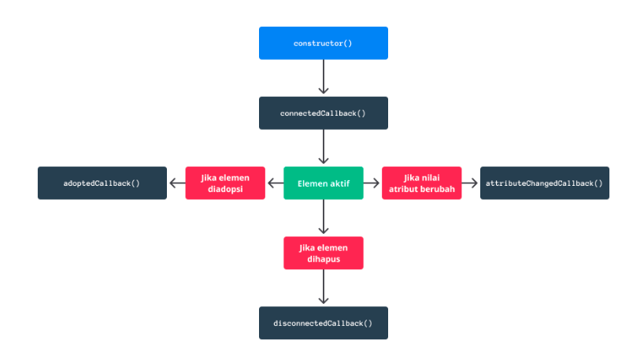
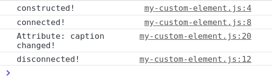
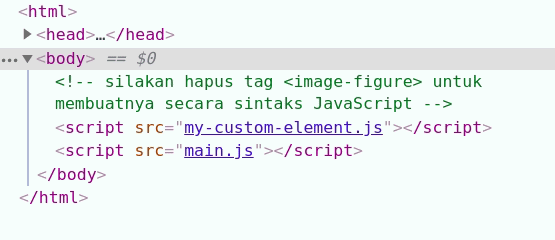

# Menulis Custom Element Pertama
-----------------------------------------------------
Dalam membuat custom element, kita menuliskannya dengan menggunakan JavaScript class. Class tersebut mewarisi sifat dari HTMLElement. HTMLElement merupakan interface yang merepresentasikan element HTML. Interface ini biasanya diterapkan pada class JavaScript sehingga terbentuklah element HTML baru melalui class tersebut (custom element).

Berikut contoh penulisan dalam membuat custom element:

```
class ImageFigure extends HTMLElement {}
```

Yeay! ImageFigure sekarang merupakan sebuah HTML element baru. Namun tunggu dulu. Untuk menggunakannya pada berkas HTML, kita perlu menetapkan nama tag yang nantinya digunakan pada HTML. Caranya dengan memanggil function define() dari global object customElements seperti ini.

```
customElements.define('image-figure', ImageFigure);
```

customElements merupakan global variable (object) yang digunakan untuk mendefinisikan custom element dan memberitahu bahwa terdapat HTML tag baru. Di dalam customElements terdapat method yang bernama define(). Di sinilah kita meletakkan tag name baru kemudian diikuti dengan JavaScript class yang menerapkan sifat HTMLElement.

***Catatan: Dalam penamaan tag untuk custom element, nama tag harus terdiri dari dua kata yang dipisahkan oleh dash (-). Jika tidak, pembuatan custom element tidak akan berhasil. Hal Ini diperlukan untuk memberi tahu browser perbedaan antara elemen asli HTML dan custom element.***

Setelah mendefinisikan custom element, barulah ia siap digunakan pada berkas HTML. Kita cukup menuliskan tag-nya layaknya elemen HTML biasa.

```
<image-figure></image-figure>
```

```
Jangan lupa lampirkan tag <script> pada berkas yang digunakan untuk menuliskan class ImageFigure.
```

```
<script src="image-figure.js"></script>
```

code lengkapnya:

file html
```
<!DOCTYPE html>
<html>
<head>
  <meta charset="utf-8">
  <meta name="viewport" content="width=device-width">
  <title>My First Custom Element</title>
</head>
<body>
  <image-figure></image-figure>
  <script src="image-figure.js"></script>
</body>
</html>
```
file js.

```
class ImageFigure extends HTMLElement {}
 
customElements.define('image-figure', ImageFigure);
```

Coba jalankan kode di atas pada browser, kita tidak akan mendapatkan apapun. Sampai saat ini, element <image-figure> berperan layaknya element <div> ataupun <span> yang tidak memiliki fungsi khusus karena kita belum menetapkan seperti apa jadinya element baru ini.


Untuk menetapkan seperti apa fungsi dari elemen baru, kita lakukan semuanya dengan menggunakan kode JavaScript yang dituliskan di dalam class ImageFigure. Tapi sebelum itu, kita pelajari dulu siklus hidup (life cycle) dari elemen HTML.


------------------------------------------------------
# Siklus Hidup dari Custom Element
Ketika sebuah JavaScript class mewarisi sifat dari HTMLElement maka class tersebut akan memiliki siklus hidup layaknya sebuah elemen HTML. Kita dapat menerapkan logika pada setiap siklus hidup yang ada dengan memanfaatkan lifecycle callbacks yang ada. Berikut ini lifecycle callbacks yang ada pada HTMLElement:

- connectedCallback(): Akan terpanggil setiap kali elemen berhasil ditambahkan ke dokumen HTML (DOM). Callback ini merupakan tempat yang tepat untuk menjalankan konfigurasi awal seperti mendapatkan data, atau mengatur attribute.

- disconnectedCallback(): Akan terpanggil setiap kali elemen dikeluarkan (remove()) dari DOM. Callback ini merupakan tempat yang tepat untuk membersihkan data yang masih disimpan pada elemen. Bisa itu event, state, ataupun objek. 

- attributeChangedCallback(): Akan terpanggil setiap kali nilai atribut yang di-observe melalui fungsi static get observedAttributes diubah. Callback ini bisa kita manfaatkan untuk memuat ulang data yang ditampilkan oleh elemen.

- adoptedCallback(): Akan terpanggil setiap kali elemen dipindahkan pada dokumen baru. Kita relatif jarang menggunakan callback ini, namun jika kita memanfaatkan tag <iframe> maka callback ini akan terpanggil.

Untuk mempermudah memahami urutan siklus hidup element pada HTML kita bisa lihat pada ilustrasi berikut:



Walaupun sebenarnya constructor() bukan termasuk siklus hidup HTML Element, namun fungsi tersebut sering digunakan untuk melakukan konfigurasi awal ketika pertama kali element dibuat. Seperti menentukan event listener, atau menetapkan Shadow DOM.

Ketika kita mengimplementasikan constructor pada custom element, kita wajib memanggil method super(). Jika tidak, maka akan menghasilkan error:

```
ReferenceError: Must call super constructor in derived class before accessing 'this' or returning from derived constructor
```

**Class yang merupakan custom element lebih ketat dibandingkan class lain. Kita tidak dapat membuat argument pada constructor class-nya. Karena instance dibuat tidak menggunakan keyword new seperti class JavaScript umumnya.**

***Terdapat dua cara membuat instance dari custom element. Yang pertama adalah menggunakan nama tagnya langsung yang dituliskan pada kode HTML. Contohnya:***

```
<body>
  <image-figure></image-figure>
</body>
```

Lalu cara kedua adalah dengan menggunakan sintaks JavaScript. Sama seperti membuat element HTML biasa, kita gunakan method document.createElement dalam membuat elemen baru.

```
const imageFigureElement = document.createElement('image-figure');
document.body.appendChild(imageFigureElement);
```

Kita bisa mencobanya sendiri dengan menuliskan kode-kode berikut dan menjalankannya pada browser. Kemudian lihat output yang dihasilkan pada browser. Output tersebut akan menunjukan urutan siklus hidup yang terpanggil.


index.html
```
<!DOCTYPE html>
<html>
<head>
  <meta charset="utf-8">
  <meta name="viewport" content="width=device-width">
  <title>Element life cycle</title>
</head>
<body>
  <!-- silakan hapus tag <image-figure> untuk membuatnya secara sintaks JavaScript -->
  <image-figure></image-figure>
  <script src="image-figure.js"></script>
  <script src="main.js"></script>
</body>
</html>
```

image-figure.js

```
class ImageFigure extends HTMLElement {
  constructor() {
    super();
    console.log('constructed!');
  }
 
  connectedCallback() {
    console.log('connected!');
  }
 
  disconnectedCallback() {
    console.log('disconnected!');
  }
 
  adoptedCallback() {
    console.log('adopted!');
  }
 
  attributeChangedCallback(name, oldValue, newValue) {
    console.log(`Attribute: ${name} changed!`);
  }
 
  // digunakan untuk mengamati perubahan nilai attribute caption
  /* kita bisa menetapkan lebih dari satu atribut yang diamati.
     dengan memisahkan nama atribut menggunakan koma. Contoh: */
 
  // return ['caption', 'title', 'src', ...]
  static get observedAttributes() {
    return ['caption'];
  }
}
 
customElements.define('image-figure', ImageFigure);
```

main.js

```
let imageFigureElement = document.querySelector('image-figure');
 
// Jika tidak tersedia pada DOM maka dibuat secara sintaksis.
if (!imageFigureElement) {
  imageFigureElement = document.createElement('image-figure');
  document.body.appendChild(imageFigureElement);
}
 
// mengubah/menambahkan nilai attribute caption.
setTimeout(() => {
  imageFigureElement.setAttribute('caption', 'Gambar 1');
}, 1000);
 
// menghapus imageFigureElement dari DOM
setTimeout(() => {
  imageFigureElement.remove();
}, 3000);
```




html structure



Implementasi lifecycle callback pada custom element bersifat opsional. Kita tidak perlu menuliskannya jika memang tidak diperlukan.

